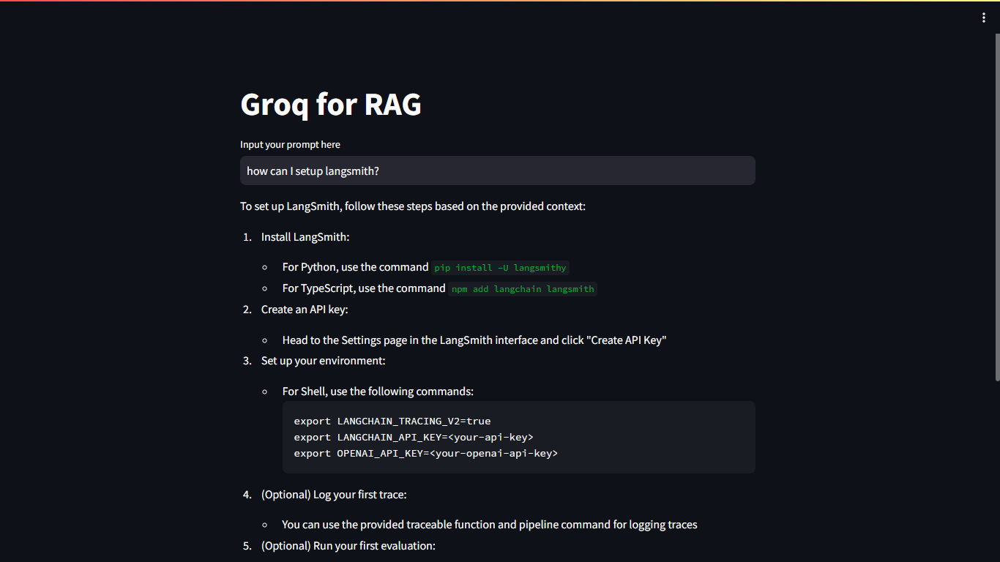

# End To End Advanced RAG Project using Open Source LLM Models And Groq Inferencing
 - In this project I have built an end to end advanced RAG project using open source llm model, Mistral using groq inferencing engine.

## DEMO
 - You can try the project live [here](https://8510-01hwj8ynshjz7spkr595x77ec2.cloudspaces.litng.ai/)

## Description
- This project showcase the implementation of an advanced RAG system that uses groq as an llm to retrieve information about langsmith.

Steps I followed:
1. I have used the `WebBaseLoader` from the `langchain_community` document loader to load the data from the `https://docs.smith.langchain.com/` webpage.
2. transformed each text into a chunk of `1000` using the `RecursiveCharacterTextSplitter` imported from the `langchain.text_splitter`
3. stored the vector embeddings which were made using the `HuggingFaceInstructEmbeddings` using the `FAISS` vector store.
4. setup the llm `ChatGroq` with the model name `mixtral-8x7b-32768`
5. Setup `ChatPromptTemplate`
6. finally created the `document_chain` and `retrieval_chain` for chaining llm to prompt and `retriever` to `document_chain` respectively

## Libraries Used
 - langchain==0.1.20
 - langchain-community==0.0.38
 - langchain-core==0.1.52
 - langchain-groq==0.1.3
 - faiss-cpu==1.8.0
 - python-dotenv

## Installation
 1. Prerequisites
    - Git
    - Command line familiarity
 2. Clone the Repository: `git clone https://github.com/NebeyouMusie/End-To-End-Advanced-RAG-Project-using-Open-Source-LLM-Models-And-Groq-Inferencing.git`
 3. Create and Activate Virtual Environment (Recommended)
    - `python -m venv venv`
    - `source venv/bin/activate`
 4. Navigate to the projects directory `cd ./End-To-End-Advanced-RAG-Project-using-Open-Source-LLM-Models-And-Groq-Inferencing` using your terminal
 5. Install Libraries: `pip install -r requirements.txt`
 6. run `streamlit run app.py`
 7. open the link displayed in the terminal on your preferred browser

## Collaboration
- Collaborations are welcomed ❤️

## Acknowledgments
 - I would like to thank [Krish Naik](https://www.youtube.com/@krishnaik06)
   
## Contact
 - LinkedIn: [Nebeyou Musie](https://www.linkedin.com/in/nebeyou-musie)
 - Gmail: nebeyoumusie@gmail.com
 - Telegram: [Nebeyou Musie](https://t.me/NebeyouMusie)

